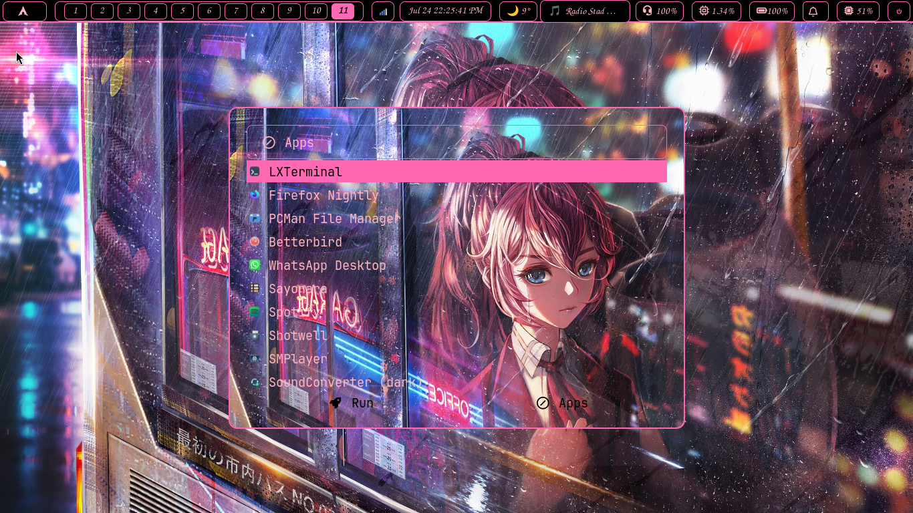
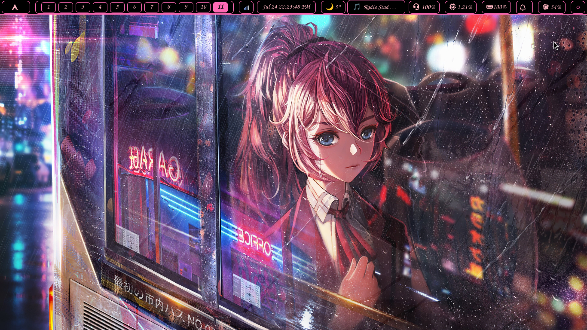
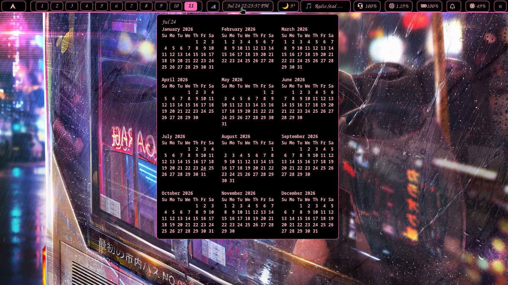
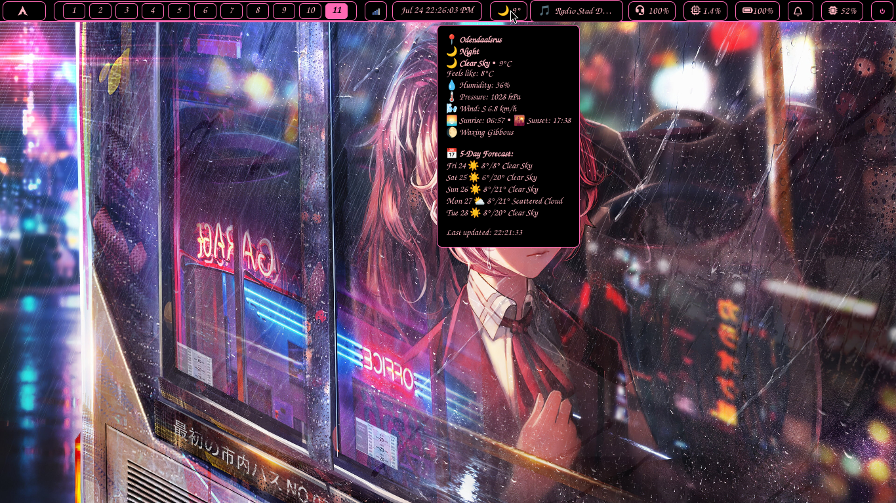
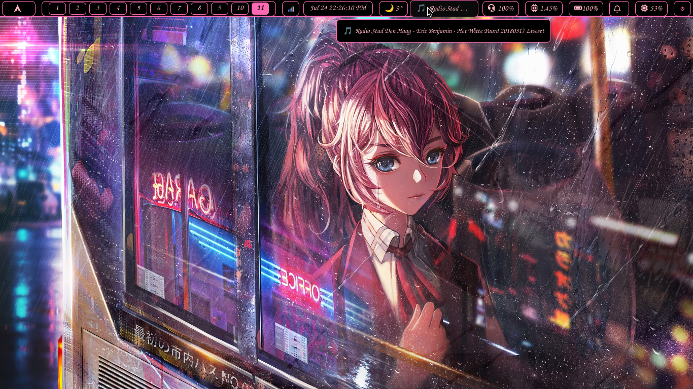
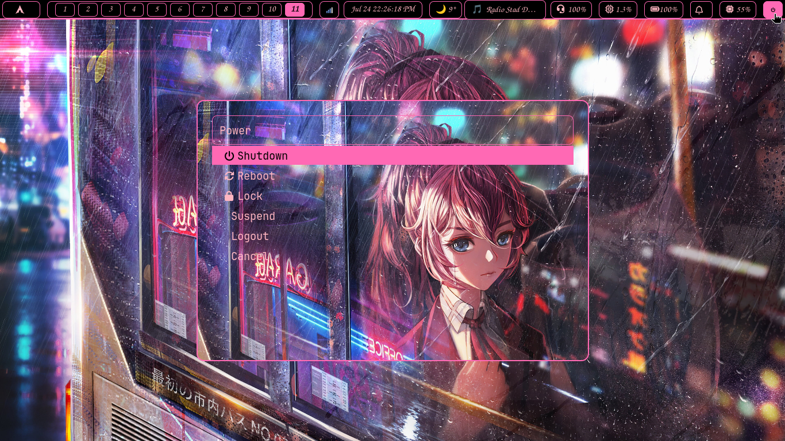

# Gallery

A visual tour of the Tiri window manager setup.

## Desktop Overview

*Main desktop view with custom Waybar*

*Desktop view with active windows*

## Calendar & Weather

*Calendar module view*

*Weather module view*

## Music & Power Menu

*Music module view*

*Power menu with system actions*
